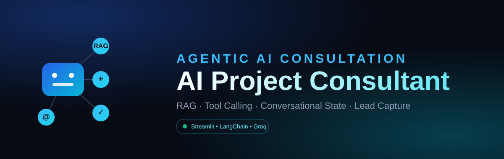
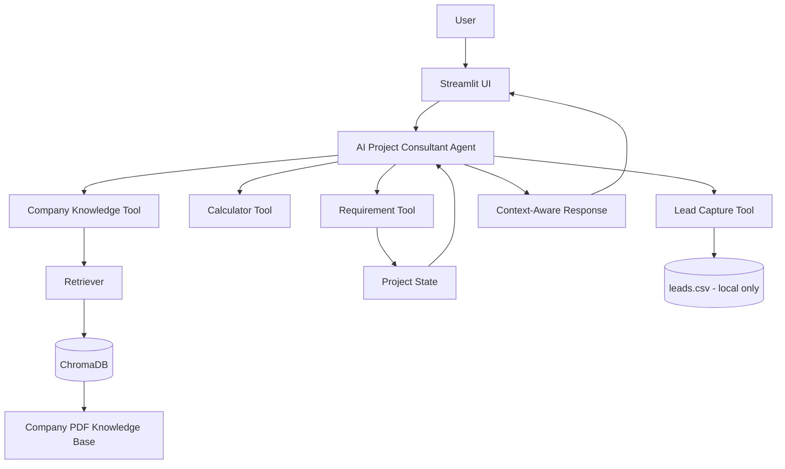
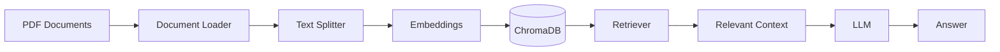

<h1 align="center">AI Project Consultant</h1>


   <p align="center">
     
   </p>

> **An Agentic AI assistant that turns project conversations into structured requirements, relevant solutions, and actionable project insights.**

AI Project Consultant is a practical **Agentic AI application** designed to help potential clients explore their project ideas and understand suitable technology solutions.

Instead of functioning as a simple question-answer chatbot, the system combines **LLM reasoning, RAG, tool calling, conversational state, requirement gathering, and lead capture** to support a complete project-consultation workflow.

---

## What It Does

| Capability | Description |
|---|---|
| **AI Agent** | Understands user messages and decides when specialized tools are needed |
| **RAG** | Retrieves company-specific information from a PDF knowledge base |
| **Conversation State** | Maintains project information across multiple turns |
| **Requirement Gathering** | Collects business type, project type, use case, budget, and timeline |
| **Tool Calling** | Uses specialized tools for calculations, knowledge retrieval, requirements, and leads |
| **Lead Capture** | Stores user contact information locally after consent |
| **Interactive UI** | Provides a custom-branded consultation experience through Streamlit |

---

## System Architecture



The application has four major layers:

1. **User Interface**: Streamlit (custom dark theme, chat-based)
2. **Agent Layer**: LLM-powered agent and decision making (LangChain and LangGraph)
3. **Knowledge & Tools Layer**: RAG, calculator, requirements, and lead tools
4. **Data Layer**: ChromaDB, PDF knowledge base, and local CSV lead storage

The agent dynamically decides which tool a request needs: retrieving company knowledge, doing a calculation, updating the project state, or capturing a lead, before producing a final response.

---

## Retrieval-Augmented Generation

The project uses **RAG** to ground responses in company-specific information rather than relying on general model knowledge.



**Why RAG?** A general-purpose LLM won't know a company's private or project-specific details. RAG lets the application store company information as documents, embed and index it in ChromaDB, and retrieve the relevant context at query time, making the consultant suitable for **company-specific project consultation** instead of generic advice.

---

## Conversational State

The consultant maintains structured project information across the conversation instead of treating each message as unrelated:

| Field | Purpose |
|---|---|
| `business_type` | Type of business or organization |
| `project_type` | Type of project or solution |
| `use_case` | What the client wants the system to accomplish |
| `budget` | Estimated project budget |
| `timeline` | Expected project timeline |

The agent checks previously provided information before asking again, and accumulates it into a single structured project state rather than treating each message in isolation.

---

## Agent Tools

| Tool | Role | Practical Purpose |
|---|---|---|
| `calculator` | Computation | Performs mathematical calculations |
| `company_knowledge` | RAG | Retrieves information from the company knowledge base |
| `update_project_requirements` | State management | Stores project requirements |
| `capture_lead` | Lead management | Captures contact information after user consent |

This lets the LLM go beyond generating text and **perform task-specific actions**.

---

## Requirement Gathering

Requirement gathering is one of the core practical components of the app. The agent collects information progressively, in this order: business type, project type, use case, budget, timeline, rather than asking for everything at once, and checks what's already known before asking again.

## Lead Capture

Lead capture is woven into the consultation flow. Once a user expresses interest and gives consent, their contact details are captured via the `capture_lead` tool and written to a local CSV. The agent is instructed not to claim a lead was captured unless the tool actually ran.

> **Note:** `leads.csv` is used for local storage only and is excluded from version control via `.gitignore`. No captured lead data is committed to this repository.

---

## Technology Stack

This project brings together a full agentic AI stack, from the LLM layer down to the vector database and UI. Every technology listed in the badges at the top of this README is actually used in the codebase, not just listed for show:

| Technology | Used For |
|---|---|
| **Python** | Core application development |
| **Streamlit** | Frontend and interactive chat UI |
| **LangChain** | LLM application framework and agent tooling |
| **LangGraph** | Agent state and checkpointing support |
| **Groq** | LLM API for natural-language understanding and generation |
| **HuggingFace / Sentence-Transformers** | Embeddings for RAG |
| **ChromaDB** | Vector database for semantic retrieval |
| **pypdf** | PDF knowledge-base ingestion |
| **python-dotenv** | Local environment variable management |
| **CSV** | Local lead storage |

---

## Knowledge & Response Reliability

The project is designed to reduce unsupported answers for company-specific information. For company-related questions, the agent uses the RAG knowledge tool rather than relying solely on general model knowledge.

The agent instructions emphasize:

- Not inventing company information
- Not inventing unsupported pricing or timelines
- Using the knowledge base for company-specific information
- Checking existing requirements before asking again
- Capturing leads only through the appropriate tool

---

## Getting Started

### 1. Clone the Repository

```bash
git clone https://github.com/fatimakh905/Ai_Project_Consultant.git
cd Ai_Project_Consultant
```

### 2. Create a Virtual Environment

**Windows**
```bash
python -m venv venv
venv\Scripts\activate
```

**macOS / Linux**
```bash
python3 -m venv venv
source venv/bin/activate
```

### 3. Install Dependencies

```bash
pip install -r requirements.txt
```

### 4. Configure API Credentials

This project uses **Groq** as its LLM provider (via `langchain-groq`) and HuggingFace-based sentence-transformer models for embeddings. Create a `.env` file in the project root:

```
GROQ_API_KEY=your_groq_api_key_here
```

> Keep API keys private and never commit them to GitHub. `.env` is already excluded via `.gitignore`.

---

## Knowledge Base Setup

Source knowledge documents live in `data/pdfs/`. Run the ingestion script to build the vector index before first launch, and re-run it any time the source PDFs change:

```bash
python ingest.py
```

```
PDFs -> Document Loading -> Text Splitting -> Embeddings -> ChromaDB -> Retriever -> Company Knowledge Tool -> AI Agent
```

---

## Run the Application

```bash
streamlit run app.py
```

Streamlit will provide a local URL you can open in your browser.

---

## Project Structure

```
Ai_Project_Consultant/
│
├── .streamlit/
├── assets/
├── chroma_db/
├── data/
│   └── pdfs/                     # company knowledge documents
│
├── src/
│   ├── agent.py
│   ├── document_loader.py
│   ├── embeddings.py
│   ├── lead_capture.py
│   ├── llm.py
│   ├── rag_chain.py
│   ├── rag_tool.py
│   ├── requirements_tool.py
│   ├── retriever.py
│   ├── text_splitter.py
│   ├── tools.py
│   └── vector_store.py
│
├── app.py
├── ingest.py
├── requirements.txt
├── LICENSE
└── .gitignore
```

### Component Responsibilities

| File / Directory | Responsibility |
|---|---|
| `app.py` | Streamlit application |
| `agent.py` | Core AI agent, state, instructions, and tool orchestration |
| `llm.py` | LLM configuration |
| `document_loader.py` | Loads knowledge-base documents |
| `text_splitter.py` | Splits documents into chunks |
| `embeddings.py` | Creates document embeddings |
| `vector_store.py` | ChromaDB vector-store handling |
| `retriever.py` | Retrieves relevant document content |
| `rag_chain.py` | RAG processing pipeline |
| `rag_tool.py` | Makes company knowledge available to the agent |
| `tools.py` | Calculator tool |
| `requirements_tool.py` | Updates project requirements |
| `lead_capture.py` | Lead-capture functionality |
| `ingest.py` | Knowledge-base ingestion |
| `data/pdfs/` | Source company knowledge documents |
| `chroma_db/` | Vector database data |

---

## Practical Business Use

The architecture can be adapted for organizations that receive software or AI project inquiries:

- Software houses
- AI development companies
- Digital agencies
- Technology consultancies
- AI automation businesses
- Client onboarding and project inquiry handling
- Sales-support workflows

It can serve as an **initial AI consultation layer**, helping organize client requirements before human involvement.

---

## License

This project is licensed under the **MIT License**. See the [LICENSE](./LICENSE) file for details.

---

| Field | Detail |
|---|---|
| **Author** | Kaneez Fatima |
| **LinkedIn** | [Click here](https://www.linkedin.com/in/kaneez-fatima-8a1516335/) |
| **Project Type** | Agentic AI Internship Project |
| **Organization** | CtrlAltCrew |
| **Domain** | AI Project Consultation / Client Onboarding |
| **Core Tech** | LangChain, LangGraph, Groq LLM, ChromaDB, Streamlit |
| **License** | MIT |


> **Internship Project & Data Note:** This project was developed during my Agentic AI Internship at **CtrlAltCrew**. All company information, services, pricing, FAQs, and other data used in this project are **synthetic and created for educational/demo purposes**. They do not represent any actual company data, services, clients, or business operations.
