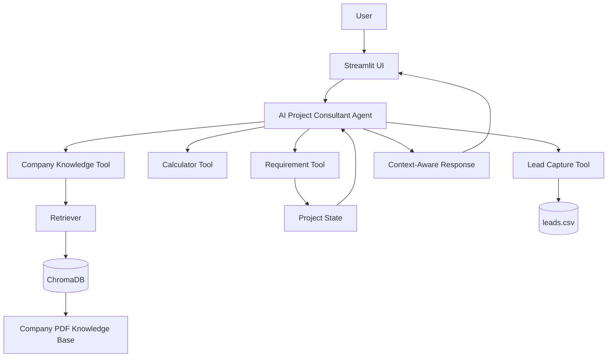
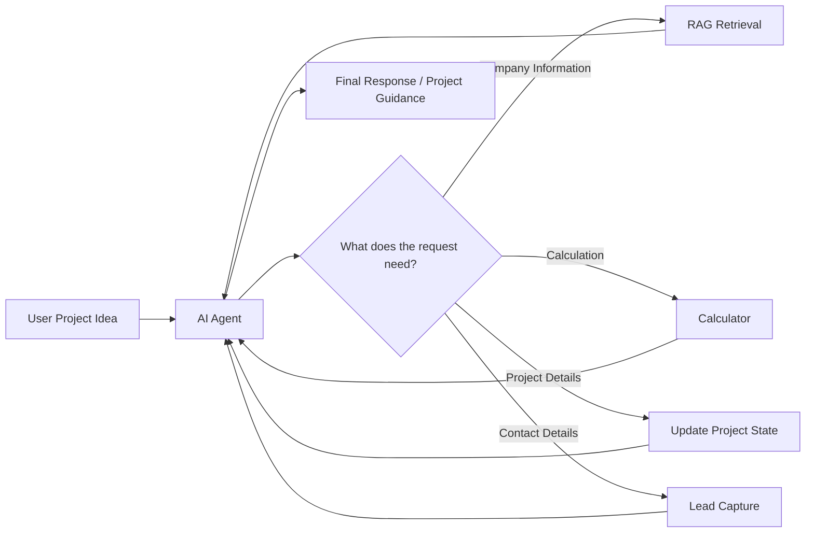
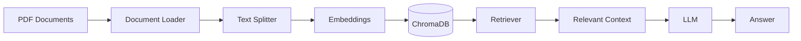
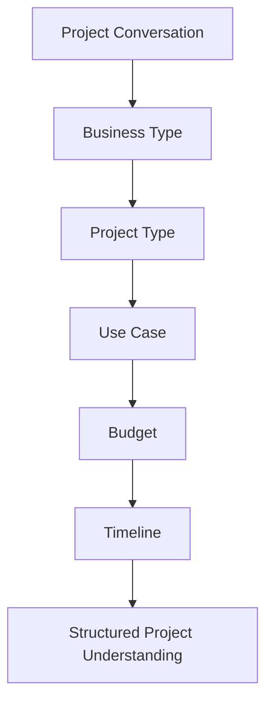
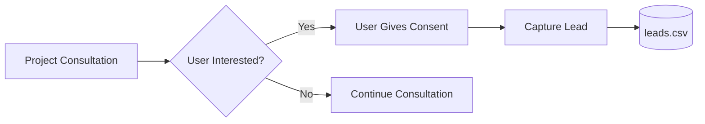

#  AI Project Consultant

> **An Agentic AI assistant that turns project conversations into structured requirements, relevant solutions, and actionable project insights.**

AI Project Consultant is a practical **Agentic AI application** designed to help potential clients explore their project ideas and understand suitable technology solutions.

Instead of functioning as a simple question-answer chatbot, the system combines **LLM reasoning, RAG, tool calling, conversational state, requirement gathering, and lead capture** to support a complete project-consultation workflow.

---

## What It Does

| Capability                   | Description                                                                           |
| ---------------------------- | ------------------------------------------------------------------------------------- |
|  **AI Agent**              | Understands user messages and decides when specialized tools are needed               |
|  **RAG**                   | Retrieves company-specific information from a PDF knowledge base                      |
|  **Conversation State**    | Maintains project information across multiple turns                                   |
|  **Requirement Gathering** | Collects business type, project type, use case, budget, and timeline                  |
|  **Tool Calling**         | Uses specialized tools for calculations, knowledge retrieval, requirements, and leads |
|  **Lead Capture**          | Stores user contact information after consent                                         |
|  **Interactive UI**        | Provides the consultation experience through Streamlit                                |

---

#  System Architecture



### Architecture at a glance

The application has four major layers:

1. **User Interface** → Streamlit
2. **Agent Layer** → LLM-powered agent and decision making
3. **Knowledge & Tools Layer** → RAG, calculator, requirements, and lead tools
4. **Data Layer** → ChromaDB, PDF knowledge base, and CSV lead storage

---

#  How the System Works



The agent dynamically works with the available tools depending on the user's request.

For example:

```text
User describes project
        ↓
Agent understands context
        ↓
Existing requirements checked
        ↓
Missing information gathered
        ↓
Relevant company information retrieved
        ↓
Tools used when necessary
        ↓
Project guidance / structured understanding
```

---

# Retrieval-Augmented Generation

The project uses **RAG** to provide company-specific information from a controlled knowledge base.

### RAG Pipeline



### Why RAG?

A general-purpose LLM may not know the private or project-specific information required by a company.

RAG allows the application to:

* Store company information in documents
* Convert document content into embeddings
* Store those embeddings in ChromaDB
* Retrieve relevant information for a user's query
* Provide the retrieved context to the AI system

This makes the consultant more suitable for **company-specific project consultation**.

---

#  Conversational State

The consultant maintains structured project information during the conversation.

The current project state contains:

| Field           | Purpose                                        |
| --------------- | ---------------------------------------------- |
| `business_type` | Type of business or organization               |
| `project_type`  | Type of project or solution                    |
| `use_case`      | What the client wants the system to accomplish |
| `budget`        | Estimated project budget                       |
| `timeline`      | Expected project timeline                      |

### Example

A user might provide information gradually:

```text
User:
I run an e-commerce business.

User:
I need an AI chatbot.

User:
It should handle customer questions.

User:
My budget is around $3000.

User:
I need it within 6 weeks.
```

Instead of treating these as unrelated messages, the agent can maintain the collected project information as conversation state.

---

#  Agent Tools

The current agent is equipped with four specialized tools:

| Tool                          | Role             | Practical Purpose                                     |
| ----------------------------- | ---------------- | ----------------------------------------------------- |
| `calculator`                  | Computation      | Performs mathematical calculations                    |
| `company_knowledge`           | RAG              | Retrieves information from the company knowledge base |
| `update_project_requirements` | State management | Stores project requirements                           |
| `capture_lead`                | Lead management  | Captures contact information after user consent       |

This allows the LLM to go beyond generating text and **perform task-specific actions**.

---

#  Requirement Gathering

Requirement gathering is one of the main practical components of the application.

The agent is designed to collect information progressively rather than asking the user for everything at once.

### Requirement flow



The agent checks previously provided information before asking additional questions, helping avoid unnecessary repetition.

---

#  Lead Capture

Lead capture is integrated into the consultation process.

The intended flow is:



Lead information is stored in the project's CSV-based lead storage.

The agent is configured to avoid claiming that a lead was successfully captured unless the lead-capture process has actually been executed.

---

#  User Interface

The application uses **Streamlit** to provide the interactive consultation interface.

The main entry point is:

```text
app.py
```

The interface allows users to interact with the AI consultant conversationally while the backend handles agent logic, retrieval, tools, and state.

---

# Project Structure

```text
Ai_Project_Consultant/
│
├── .streamlit/
│
├── assets/
│
├── chroma_db/
│
├── data/
│   └── pdfs/
│       └── company knowledge documents
│
├── src/
│   ├── agent.py
│   ├── document_loader.py
│   ├── embeddings.py
│   ├── lead_capture.py
│   ├── llm.py
│   ├── rag_chain.py
│   ├── rag_tool.py
│   ├── requirements_tool.py
│   ├── retriever.py
│   ├── text_splitter.py
│   ├── tools.py
│   └── vector_store.py
│
├── app.py
├── ingest.py
├── leads.csv
├── requirements.txt
└── .gitignore
```

## Component Responsibilities

| File / Directory       | Responsibility                                            |
| ---------------------- | --------------------------------------------------------- |
| `app.py`               | Streamlit application                                     |
| `agent.py`             | Core AI agent, state, instructions and tool orchestration |
| `llm.py`               | LLM configuration                                         |
| `document_loader.py`   | Loads knowledge-base documents                            |
| `text_splitter.py`     | Splits documents into chunks                              |
| `embeddings.py`        | Creates document embeddings                               |
| `vector_store.py`      | ChromaDB vector-store handling                            |
| `retriever.py`         | Retrieves relevant document content                       |
| `rag_chain.py`         | RAG processing pipeline                                   |
| `rag_tool.py`          | Makes company knowledge available to the agent            |
| `tools.py`             | Calculator tool                                           |
| `requirements_tool.py` | Updates project requirements                              |
| `lead_capture.py`      | Lead-capture functionality                                |
| `ingest.py`            | Knowledge-base ingestion                                  |
| `data/pdfs/`           | Source company knowledge documents                        |
| `chroma_db/`           | Vector database data                                      |
| `leads.csv`            | Captured lead data                                        |

---

#  Technology Stack

| Technology     | Used For                                      |
| -------------- | --------------------------------------------- |
| **Python**     | Application development                       |
| **Streamlit**  | Frontend / interactive UI                     |
| **LangChain**  | LLM application and agent tooling             |
| **LangGraph**  | Agent state/checkpointing support             |
| **ChromaDB**   | Vector database                               |
| **LLM API**    | Natural-language understanding and generation |
| **PDF Loader** | Knowledge-base document ingestion             |
| **CSV**        | Lead storage                                  |

---

#  Knowledge & Response Reliability

The project is designed to reduce unsupported answers for company-specific information.

For company-related questions, the agent can use the RAG knowledge tool rather than relying solely on general model knowledge.

The agent instructions also emphasize:

* Not inventing company information
* Not inventing unsupported pricing
* Not inventing unsupported timelines
* Using the knowledge base for company-specific information
* Checking existing requirements before asking again
* Capturing leads only through the appropriate tool

This helps keep the consultation grounded in the information available to the application.

---

#  Getting Started

## 1. Clone the Repository

```bash
git clone https://github.com/fatimakh905/Ai_Project_Consultant.git
cd Ai_Project_Consultant
```

## 2. Create a Virtual Environment

### Windows

```bash
python -m venv venv
venv\Scripts\activate
```

### macOS / Linux

```bash
python3 -m venv venv
source venv/bin/activate
```

## 3. Install Dependencies

```bash
pip install -r requirements.txt
```

## 4. Configure API Credentials

Add the required LLM API credentials to your local environment according to the provider configured in the project.

Example:

```env
OPENAI_API_KEY=your_api_key_here
```

> Keep API keys private and never commit them to GitHub.

---

#  Knowledge Base Setup

The source knowledge documents are located in:

```text
data/pdfs/
```

The ingestion script:

```text
ingest.py
```

processes the documents and prepares the vector database used by the RAG system.

### Knowledge-base workflow

```text
PDFs
 ↓
Document Loading
 ↓
Text Splitting
 ↓
Embeddings
 ↓
ChromaDB
 ↓
Retriever
 ↓
Company Knowledge Tool
 ↓
AI Agent
```

If the source documents are changed, the knowledge base should be regenerated using the project's ingestion workflow.

---

# Run the Application

Start Streamlit with:

```bash
streamlit run app.py
```

The application will provide a local URL that can be opened in a browser.

---

#  Example Consultation

### User

> I own a small online clothing business and want an AI chatbot for customer support.

### Consultant

The agent can identify the business and project type, then continue gathering relevant details.

### User

> It should answer product questions and help customers.

The use case is added to the project understanding.

### User

> My budget is around $3000 and I need it in 6 weeks.

The budget and timeline can then be stored as part of the project state.

### Result

The system can use the collected requirements together with relevant company knowledge to provide more contextual project guidance.

---

#  Technical Highlights

The project demonstrates several important concepts in modern AI application development:

| Concept                    | Implementation                             |
| -------------------------- | ------------------------------------------ |
| **LLM Application**        | LLM-powered consultation agent             |
| **RAG**                    | PDF knowledge base + embeddings + ChromaDB |
| **Semantic Retrieval**     | Vector similarity search                   |
| **Tool Calling**           | Four specialized agent tools               |
| **Conversational State**   | Structured project state + checkpointing   |
| **Requirement Extraction** | Progressive project information gathering  |
| **Lead Workflow**          | Consent-based lead capture                 |
| **AI UI**                  | Streamlit application                      |

---

# Practical Business Use

The architecture can be adapted for organizations that receive software or AI project inquiries.

Potential applications include:

* Software houses
* AI development companies
* Digital agencies
* Technology consultancies
* AI automation businesses
* Client onboarding
* Project inquiry handling
* Sales-support workflows

The system can serve as an **initial AI consultation layer**, helping organize client requirements before human involvement.

---


# 📌 Project Highlights

**AI Project Consultant** brings together:

```text
                 ┌─────────────────┐
                 │       LLM       │
                 └────────┬────────┘
                          │
          ┌───────────────┼───────────────┐
          │               │               │
          ▼               ▼               ▼
       RAG             Tools          State
          │               │               │
     ChromaDB       Calculator       Requirements
     PDF Knowledge   RAG Tool         Conversation
                     Lead Capture
          │               │               │
          └───────────────┼───────────────┘
                          ▼
                AI Project Consultant
                          │
                          ▼
                 Structured Guidance
```

The project demonstrates how an AI system can move beyond simple text generation by combining **knowledge retrieval, tool use, conversational state, and structured workflows** in a practical application.

---

#  Author

**Kaneez Fatima**

---

> **Internship Project & Data Note:** This project was developed during my Agentic AI Internship at **CtrlAltCrew**. All company information, services, pricing, FAQs, and other data used in this project are **synthetic and created for educational/demo purposes**. They do not represent any actual company data, services, clients, or business operations.


